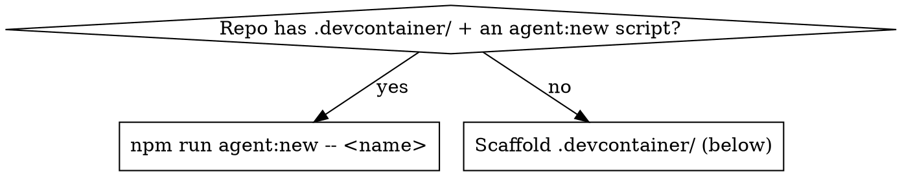

# Dev containers

## Overview

A dev container is an isolated Docker environment that runs Claude Code, the
terminal, and build tools *inside the container* while your repo is bind-mounted
in, so edits still appear on the host. **This is the mandated isolation
mechanism — git worktrees are forbidden** (project + global rule). Anything that
proposes a worktree (including `superpowers:using-git-worktrees`) is overridden;
substitute the steps below.

## When to use

- Work must not touch the current workspace (risky migration, throwaway spike).
- Two or more agents/features run at once and would collide on one tree.
- You were about to create a git worktree → stop, do this instead.

## Decision: reuse or scaffold



`npm run agent:new -- <name>` clones into `.agents/<name>/` on branch
`agent/<name>` (gitignored, excluded from jest/tsc/eslint); open that folder in
its own container and work there. One container per agent for parallel work.

## Scaffold a `.devcontainer/`

Minimal — installs the Claude Code CLI via Anthropic's official feature:

```json
{
  "image": "mcr.microsoft.com/devcontainers/base:ubuntu",
  "features": {
    "ghcr.io/devcontainers/features/node:1": {},
    "ghcr.io/anthropics/devcontainer-features/claude-code:1.0": {}
  },
  "remoteUser": "node"
}
```

Then rebuild (VS Code: **Dev Containers: Rebuild Container**) and run `claude`
inside to authenticate. Replace `image` with the project's base image, or drop
it if a `Dockerfile` is used (the feature needs Node.js present, or it
best-effort installs an LTS).

## Hardening (add only what the task needs)

| Goal | Add |
| ---- | --- |
| Persist auth/settings across rebuilds | Mount a volume to the `remoteUser`'s `~/.claude`: `source=claude-code-config-${devcontainerId}`, `target=/home/node/.claude`. (`${devcontainerId}` isolates state per project.) |
| Unattended runs (`--dangerously-skip-permissions`) | Set `remoteUser` to a **non-root** account — the CLI rejects the flag as root. Pair with egress limits below. |
| Restrict network egress | Add the reference [`init-firewall.sh`](https://github.com/anthropics/claude-code/blob/main/.devcontainer/init-firewall.sh) + `"runArgs": ["--cap-add=NET_ADMIN", "--cap-add=NET_RAW"]`. Allowlist: see [network-config](https://code.claude.com/docs/en/network-config#network-access-requirements). |

Don't mount host secrets (`~/.ssh`, cloud creds) — prefer repo-scoped or
short-lived tokens. Only use dev containers with trusted repositories.

## Common mistakes

- **Reaching for a git worktree** — banned; use a dev container.
- **`--dangerously-skip-permissions` as root** — rejected; set non-root `remoteUser`.
- **Firewall without `NET_ADMIN`/`NET_RAW`** — `init-firewall.sh` can't apply rules.
- **Expecting auth to survive a rebuild without the volume mount** — it won't.

## Reference

- Setup, hardening, org policy: https://code.claude.com/docs/en/devcontainer
- The CLI feature: https://github.com/anthropics/devcontainer-features/tree/main/src/claude-code
- Full reference container (`devcontainer.json`, `Dockerfile`, `init-firewall.sh`): https://github.com/anthropics/claude-code/tree/main/.devcontainer
